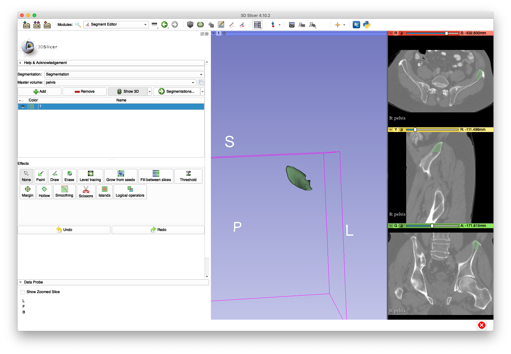
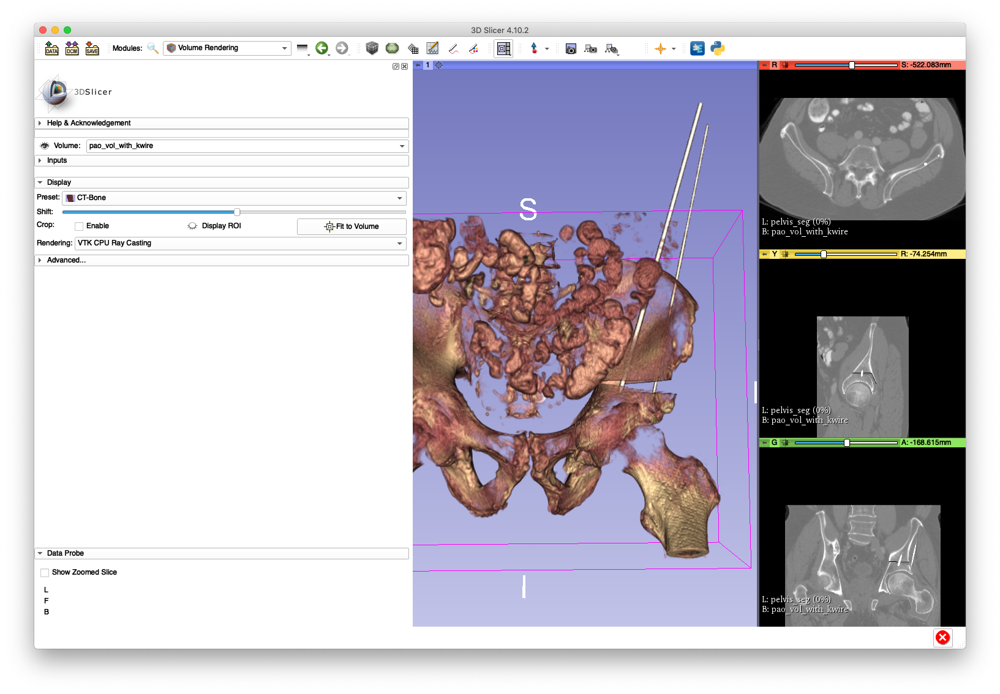
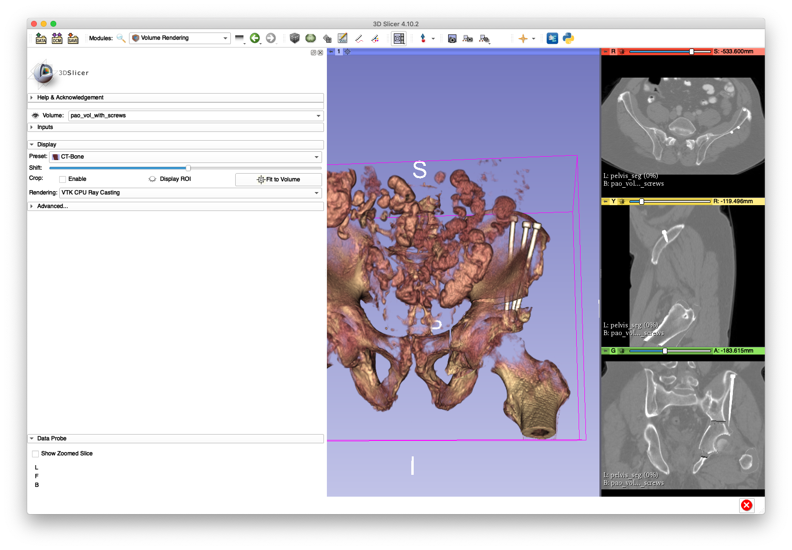

# Volumetric Modeling of Periacetabular Osteotomy Fragment Fixation
This tool simulates the insertion of screws and K-wires for fixation of a periacetabular osteotomy (PAO) fragment.
Shapes and poses of the inserted objects are randomly computed.
The insertion is performed volumetrically in order to enable realistic simulation studies.

A comprehensive listing of the program's usage may be obtained by passing `-h` or `--help`.

## Example 1
This example demonstrates the simulated insertion of two random K-wires.
K-wire fixation represents a temporary fixation that could be used during pose estimation, or verification, of the PAO fragment.
Data created as part of the following examples will be used as input to this example:
  * The `pelvis_seg.nii.gz` segmentation created in the [second create mesh example](../../../mesh/create_mesh)
  * The `pao_vol.nii.gz` volume created in the [PAO volume example](../create_repo_vol)
  * The fragment created in [example 1 of the create fragment tool](../create_fragment)
  * A random movement of the fragment and femur from the [example of the random fragment motion sampler](../sample_frag_moves)

In addition to the above data, this tool requires a mask which is used to create a surface of plausible K-wire insertion points.
This can be created by modifying the original pelvis segmentation (`pelvis_seg.nii.gz`) to only include portions of the left iliac crest.
An example of this modified segmentation in 3D Slicer is shown in the following screenshot:


Assuming that the insertion mask is saved as `pelvis_left_insertion_labels.nii.gz`, the following command will create a new volume with inserted K-wires:
```
jhmr-pao-add-screw-kwires-to-vol -v --super-sample 2 pao_vol.nii.gz pao_cuts_seg.nii.gz pelvis_app_lands.fcsv left test_pao_frag_0.h5 pelvis_left_insertion_labels.nii.gz pao_vol_with_kwire.nii.gz --p-two 1 --p-wire 1
```

The updated volume may be visualized in 3D Slicer as demonstrated by the following screenshot:


## Example 2
This example requires the same input data as the previous example, but differs in that it will insert three random screws.
The use of screws simulates a permanent fixation.
The following command is used:
```
jhmr-pao-add-screw-kwires-to-vol -v --super-sample 2 pao_vol.nii.gz pao_cuts_seg.nii.gz pelvis_app_lands.fcsv left test_pao_frag_0.h5 pelvis_left_insertion_labels.nii.gz pao_vol_with_screws.nii.gz --p-two 0 --p-wire 0
```
An example 3D Slicer visualization is given by the following screenshot:

