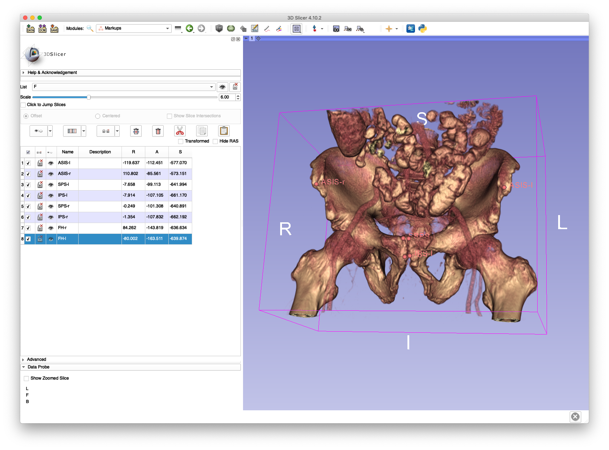
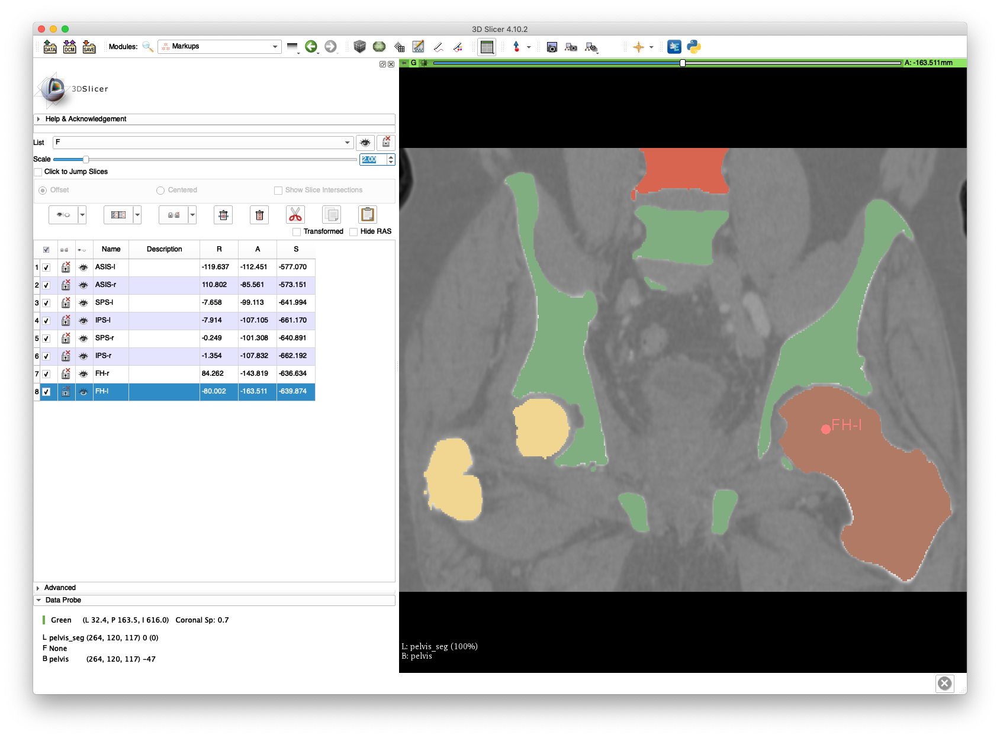
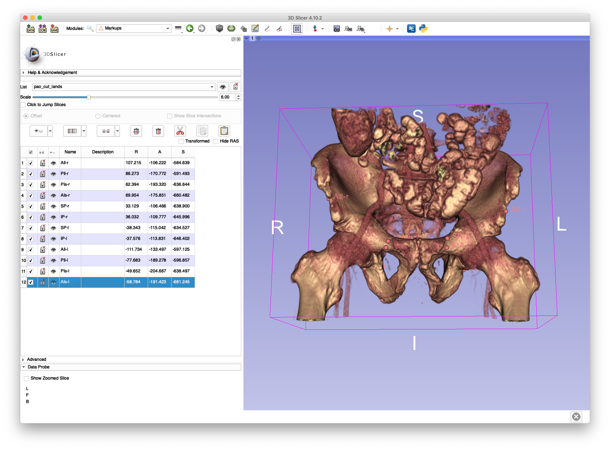
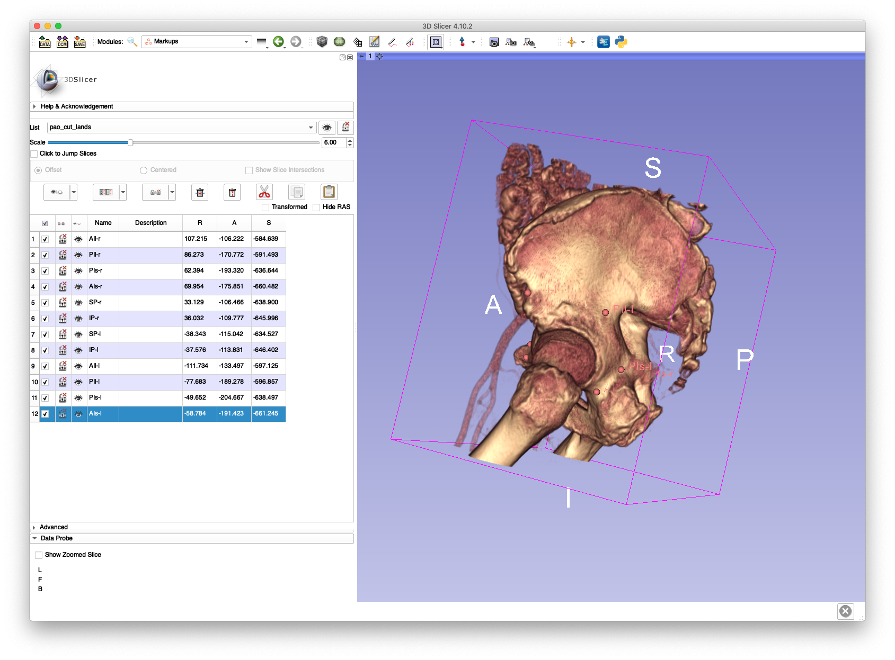
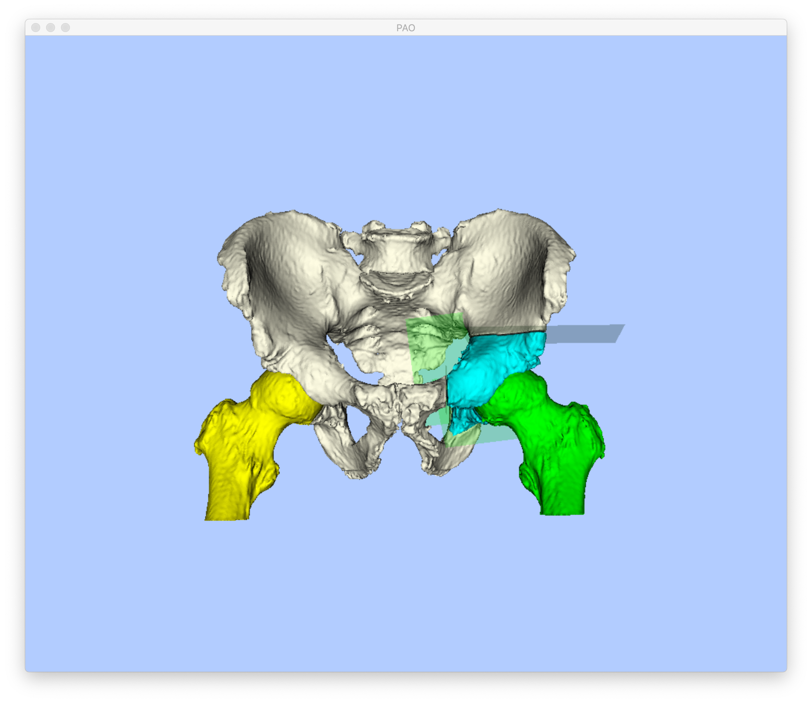
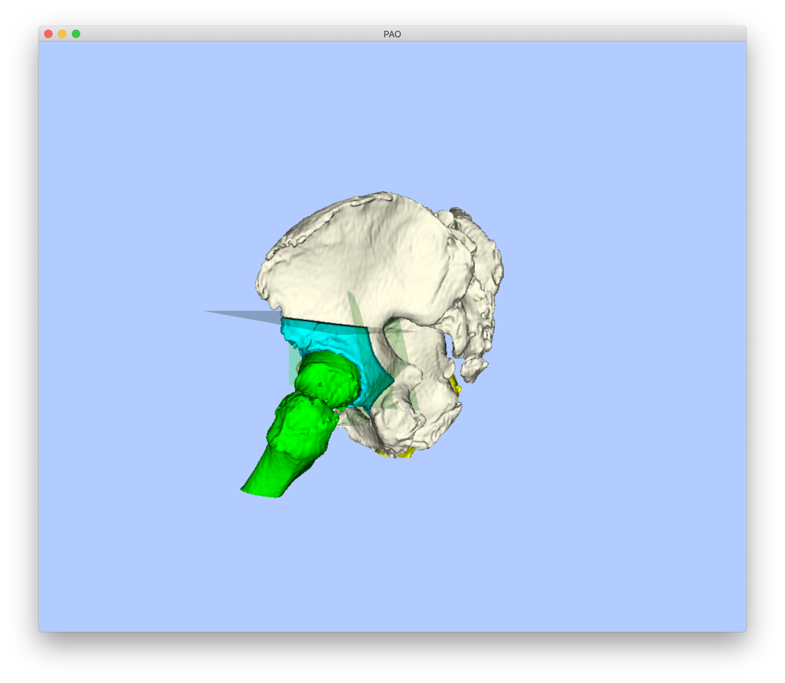

# Modeling and Planning Periacetabular Osteotomies
This tool may be used to construct volumetric labelings of periacetabular osteotomy (PAO) fragment shapes.
The fragment shape is defined by a series of four cuts through the pelvis and about the acetabulum.
Six 3D anatomical landmarks are the primary mechanism used to define each PAO cut.
An anterior point on the ilium (AIl), typically on the iliac spine, and a more posteriorly located ilium point (PIl) are used to define the ilium cut.
The ischial cut is also defined with anterior (AIs) and posterior (PIs) points on the cutting plane.
The posterior points of the ilium and ischial cuts (PIl and PIs) are used to define the posterior cut.
Finally, the pubic cut is defined by a point on the superior aspect of the pubis (SP) and another point on the inferior aspect of the pubis (IP).
When annotating these landmarks, the left and right side is indicated by appending "-r" or "-l" to each landmark's name.
For example, "AIs-r" is the right anterior ischial cut landmark and "PIl-l" is the posterior ilium cut landmark.
The following landmarks must also be annotated in order to define the Anterior Pelvic Plane (APP) coordinate frame:
* Left and right anterior superior iliac spine (ASIS-{l,r})
* Left and right superior pubic symphyses (SPS-{l,r})
* Left and right inferior pubic symphyses (IPS-{l,r})
* Left and right femoral head centers (FH-{l,r})

A comprehensive listing of the program's usage may be obtained by passing `-h` or `--help`.

## Example 1
This example demonstrates the creation of a single instance of PAO cuts using manually identified landmarks.
The `pelvis.nii.gz` volume created in the [crop volume example](../../../image_io/crop_vol) and the `pelvis_seg.nii.gz` segmentation created in the [second create mesh example](../../../mesh/create_mesh) will be reused in this example.
A volume rendering of `pelvis.nii.gz` in 3D Slicer will be used to annotate landmarks and save them to FCSV files.

The following two screenshots show examples of annotated APP landmarks.


The corresponding FCSV file for APP landmarks is provided [here](zz_readme/pelvis_app_lands.fcsv).

The annotation of cut landmarks is illustrated in the following two screenshots.


The corresponding FCSV file for the cut landmarks is provided [here](zz_readme/pao_cut_lands.fcsv).

The following command will create a PAO fragment on the left side of the subject:
```
jhmr-pao-create-frag pelvis_seg.nii.gz pelvis_app_lands.fcsv pao_cut_lands.fcsv left - pao_cuts_seg.nii.gz pao_cut_defs.h5
```

The segmentation, updated to account for the fragment and cuts, is saved in `pao_cuts_seg.nii.gz` and the definition of the cutting planes is saved into `pao_cut_defs.h5`.

The fragment may be visualized in 3D by either loading the segmentation into 3D Slicer or by using the [`jhmr-pao-draw-bones` tool](../draw_bones) with the following command:
```
jhmr-pao-draw-bones pao_cuts_seg.nii.gz pelvis_app_lands.fcsv left --cut-defs pao_cut_defs.h5
```
This should bring up an interactive display similar to the two screenshots below:



## Example 2
This example demonstrates the ability of this tool to create random sets of PAO cuts.
A large collection of random fragment shapes is useful for conducting simulation studies related to PAO applications.
The cuts computed in the previous example are used in this example as input using the following command:
```
jhmr-pao-create-frag pelvis_seg.nii.gz pelvis_app_lands.fcsv pao_cut_defs.h5 left - pao_cuts_seg_batch pao_cut_defs_batch --batch 5 --add-noise-planes --use-normal-dist-plane-noise -v
```
This command creates five new PAO fragments by applying random transformations to the cutting planes.
One of the updated planes may now be visualized:
```
jhmr-pao-draw-bones pao_cuts_seg_batch_000.nii.gz pelvis_app_lands.fcsv left --cut-defs pao_cut_defs_batch_000.h5
```

Comparing this visualization with that from Example 1 highlights changes in both the pubis and ilium cuts.

It is recommended that more cuts be sampled than actually needed, since it may be the case that a random set of cuts is not realistic.
For example, the acetabulum may be cut in half.
Manual inspection of the cuts should be performed in order to reject any implausible sets.
Portions of the obturator foramen are sometimes also included in the fragment. This can be avoided by providing an additional mask of invalid fragment locations using the `--invalid-mask` flag.