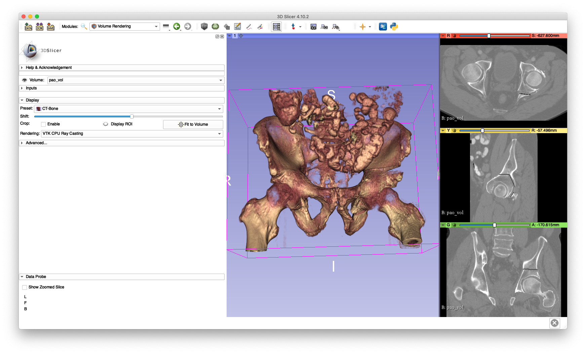

# Volumetric Modeling of Periacetabular Osteotomies
This tool allows periacetabular osteotomies to be modeled volumetrically, both shape and rigid movement, which enables simulation studies incorporating Hounsfield units and soft tissue.

A comprehensive listing of the program's usage may be obtained by passing `-h` or `--help`.

## Example
Data created as part of the following examples will be used as input to this example:
  * The `pelvis.nii.gz` volume created in the [crop volume example](../../../image_io/crop_vol)
  * The `pelvis_seg.nii.gz` segmentation created in the [second create mesh example](../../../mesh/create_mesh)
  * The fragment created in [example 1 of the create fragment tool](../create_fragment)
  * A random movement of the fragment and femur from the [example of the random fragment motion sampler](../sample_frag_moves)

The following command will create a CT volume incorporating the osteotomies and movement of the fragment:
```
jhmr-pao-create-repo-vol pelvis.nii.gz pao_cuts_seg.nii.gz pelvis_app_lands.fcsv left test_pao_frag_0.h5 test_pao_femur_0.h5 pao_vol.nii.gz
```

The output volume may be loaded into 3D Slicer and visualized to verify the fragment creation and relocation (shown in the screenshot below).



