# Simulation of Fluoroscopy Images During Hip Surgery
This tool creates synthetic fluoroscopy images using geometries typically associated with hip surgery.
The tool will create a series of three-view collections, where each collection has an approximate AP view and two additional views at orbital rotations.
Nominal parameters for a [Siemens CIOS Fusion C-arm](https://www.siemens-healthineers.com/en-us/surgical-c-arms-and-navigation/mobile-c-arms/cios-fusion) with 30 cm detector are used.
Randomness is introduced by sampling the movement of the C-arm, the pose of the volume, and the detected X-ray intensities (Poisson sampling).
Although a single volume is used as input, extensions are possible that would enable multiple volumes and analytic objects.

A comprehensive listing of the program's usage may be obtained by passing `-h` or `--help`.

## Example 1
This example uses the volume (`pao_vol_with_kwire.nii.gz`) created as part of example 1 of the [screw and K-wire volumetric modeling tool](../add_screw_kwires_to_vol) for periacetabular osteotomy (PAO).

### Default Parameters
Run the following command to create five three-view collections using the default parameters:
```
jhmr-pao-create-synth-fluoro -v pao_vol_with_kwire.nii.gz pelvis_app_lands.fcsv left 5 example1_1_pd example1_1_pose
```

The fourth collection may be viewed using the [remap and tile tool](../../../image_io/remap_and_tile_proj_data) with the following command:
```
jhmr-remap-tile-proj-data example1_1_pd_003.h5 example1_1_pd_003.png -d 0.25 -b 1
```
An image similar to this should be produced:
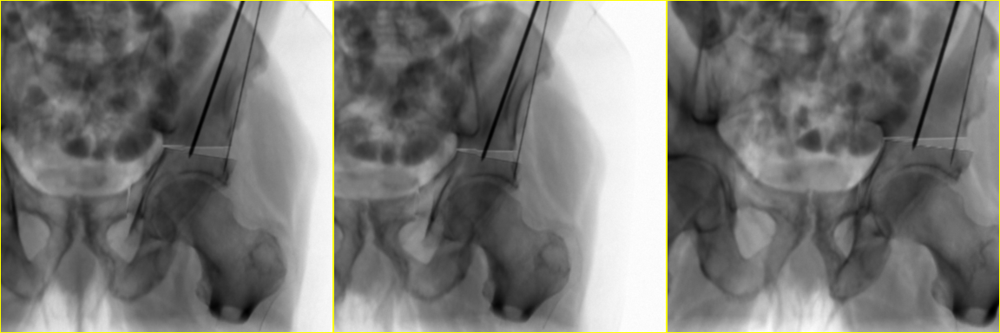

The geometry of the fourth collection may also be viewed using the [X-ray scene tool](../../../image_io/draw_xray_scene) and the following command:
```
jhmr-draw-xray-scene example1_1_pd_003.h5
```
This should start an interactive visualization tool with views similar to the following:
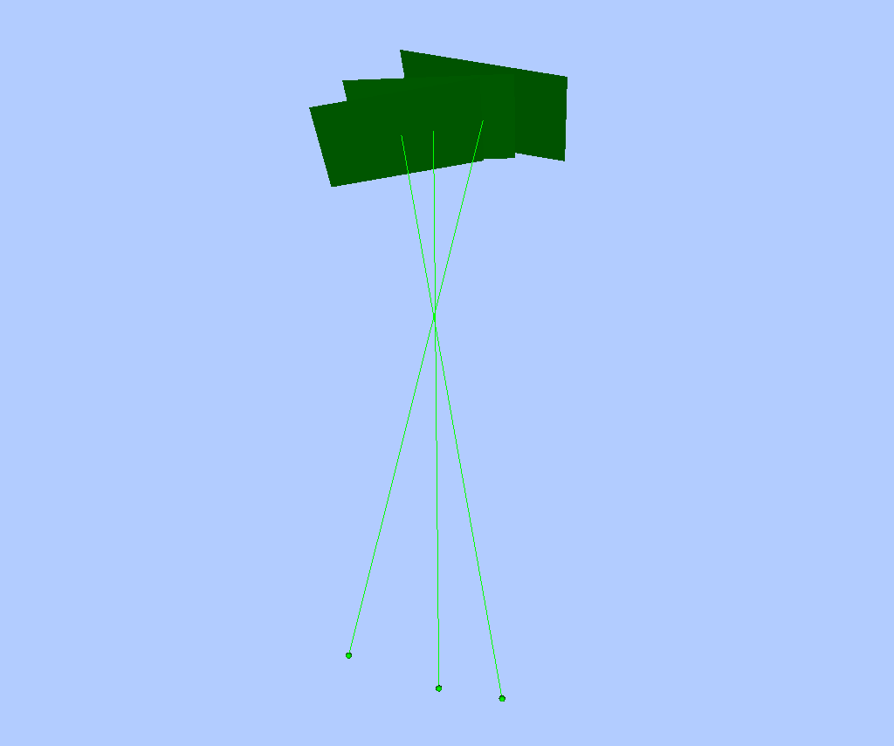

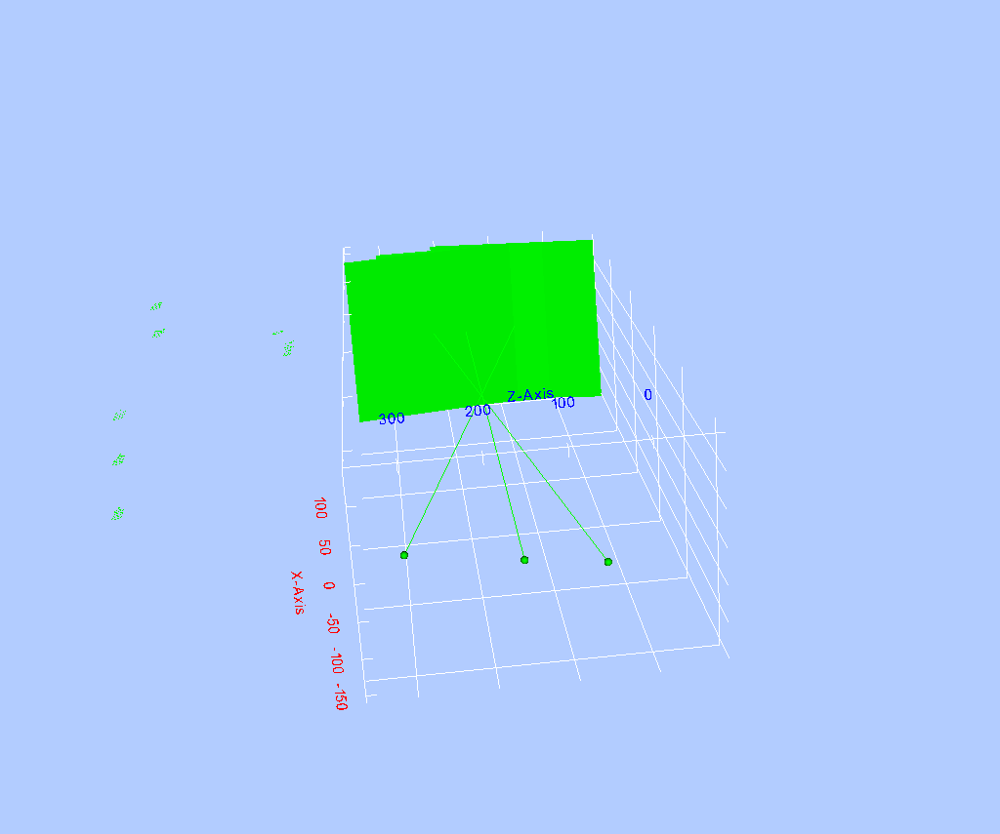
Screenshots may be saved into the current working directory by pressing the `s` key.
The green squares represent the detector plane of the C-arm, the green spheres represent the X-ray source, and the green lines indicate the lines connecting the X-ray source to the principal point on the detector.
Axes may be toggled by pressing the `a` key.

Each fluoroscopic image may be superimposed on the detector by passing the `-i` flag:
```
jhmr-draw-xray-scene -i example1_1_pd_003.h5
```
This should produce a visualization with views similar to the following:
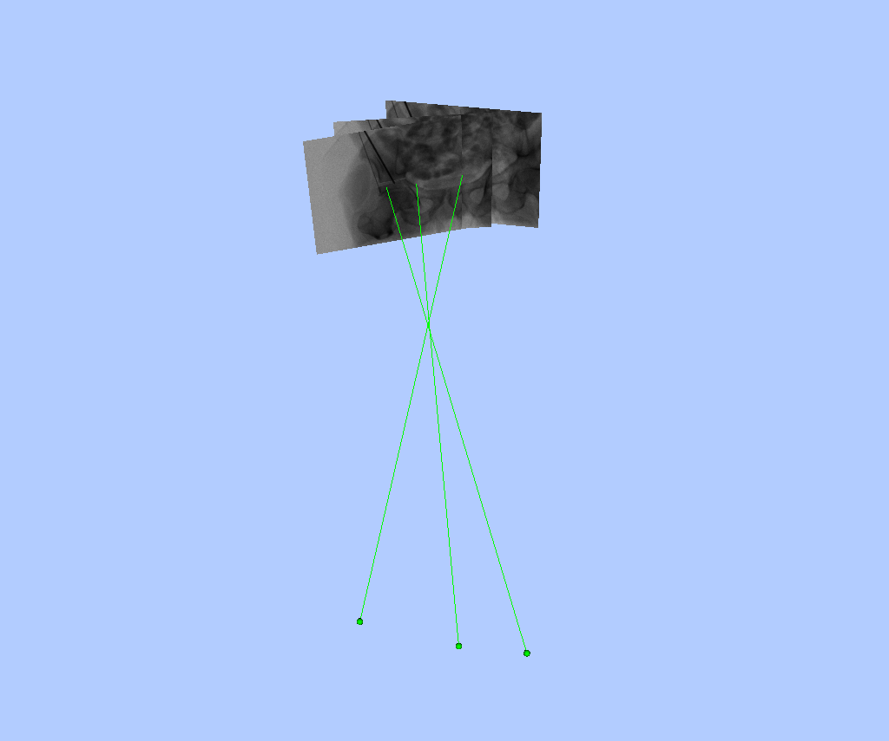
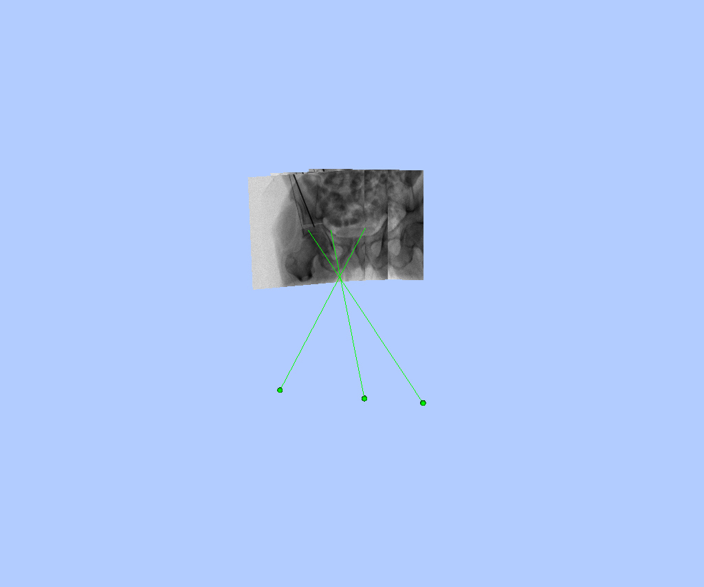

The X-ray scene visualization tool can also include surfaces and point clouds.
In order to include a rendering of the volume with respect to the C-arm geometries, a surface must first be created using the [create mesh tool](../../../mesh/create_mesh) and the following command:
```
jhmr-create-mesh -i --lower 300 pao_vol_with_kwire.nii.gz pao_w_kwire_mesh.h5
```
The surface and corresponding pose are then passed to the scene visualizer:
```
jhmr-draw-xray-scene -i example1_1_pd_003.h5 pao_w_kwire_mesh.h5 example1_1_pose_003.h5
```
This should produce a visualization with views similar to the following:
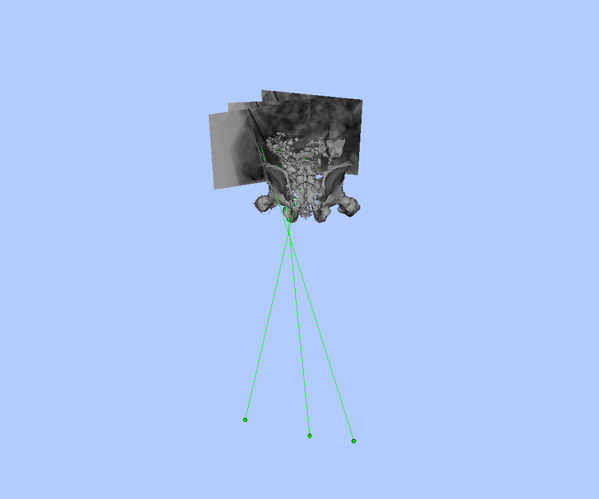
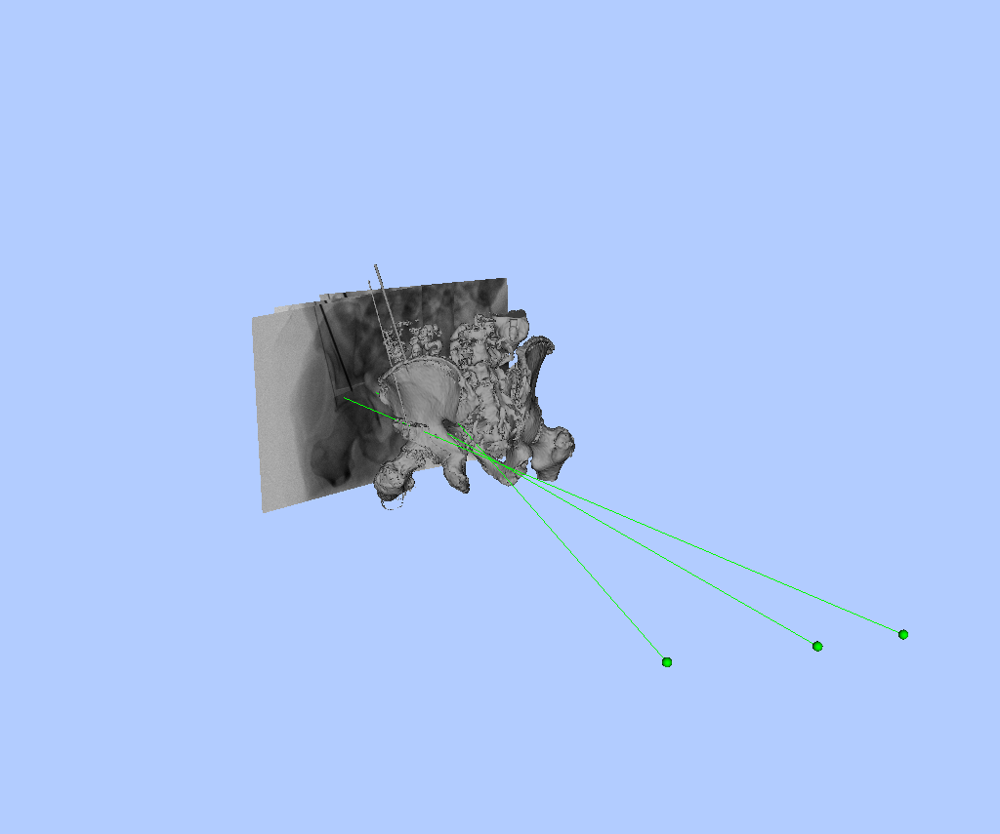

### Larger Orbital Rotations
The following command demonstrates how larger orbital rotations may be sampled:
```
jhmr-pao-create-synth-fluoro -v pao_vol_with_kwire.nii.gz pelvis_app_lands.fcsv left 5 example1_2_pd example1_2_pose --mean-orbit-rot-1 -30 --mean-orbit-rot-2 35
```

The larger rotations of the C-arm along its orbit may be verified using the X-ray scene visualizer:
```
jhmr-draw-xray-scene -i example1_2_pd_003.h5 pao_w_kwire_mesh.h5 example1_2_pose_003.h5
```
This should produce a visualization with views similar to the following:
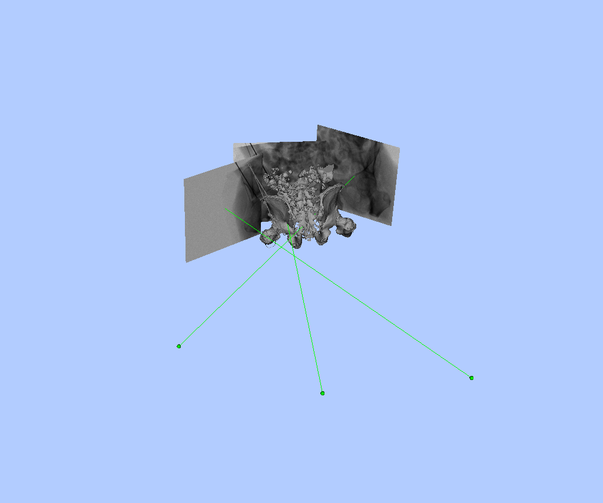


The image intensities may also be remapped for quick display:
```
jhmr-remap-tile-proj-data example1_2_pd_003.h5 example1_2_pd_003.png -d 0.25 -b 1
```
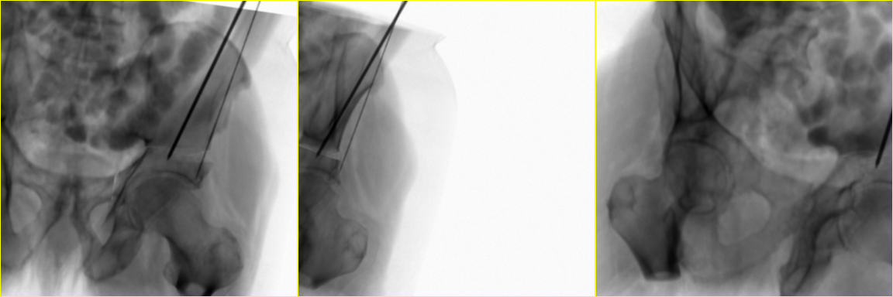

### Lower Photon Count
The following command illustrates how to lower the photon count and increase the amount of noise present in the fluoroscopy images:
```
jhmr-pao-create-synth-fluoro -v pao_vol_with_kwire.nii.gz pelvis_app_lands.fcsv left 5 example1_3_pd example1_3_pose --num-photons 100
```

The noise may be verified by inspecting the images:
```
jhmr-remap-tile-proj-data example1_3_pd_000.h5 example1_3_pd_000.png -d 0.25 -b 1
```
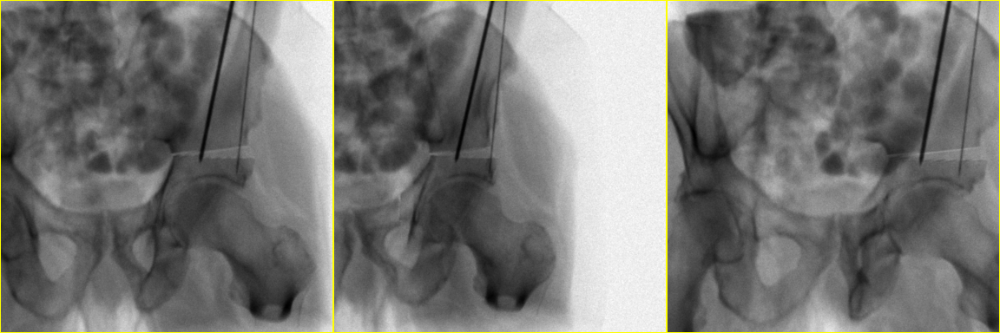

## Example 2
Due to the cropping applied to the volume used in the previous example, the some aspects of the simulated fluoroscopy are particularly unrealistic, specifically the areas concerning each femur.
In order to demonstrate a more realistic appearance, this example simulates fluoroscopy prior to any cropping.
The `Pelvic-Ref-007_00.nii.gz` volume created from Example 3 of the [DICOM resampler tool](../../../image_io/convert_resample_dicom) tool is used.

An example of annotated APP landmarks for this volume are provided [here](zz_readme/Pelvic-Ref-007_00_app_lands.fcsv).

The following command creates 1 collection of simulated fluoroscopy focused on the right side of the subject:
```
jhmr-pao-create-synth-fluoro -v Pelvic-Ref-007_00.nii.gz Pelvic-Ref-007_00_app_lands.fcsv right 1 example2_pd example2_pose
```

The appearance may be inspected using the remap tool:
```
jhmr-remap-tile-proj-data example2_pd_000.h5 example2_pd_000.png --flip-rows --flip-cols -d 0.25 -b 1
```
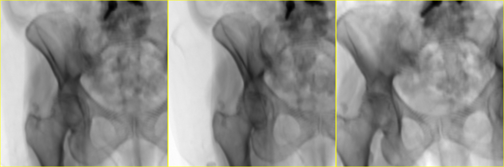

In this example there are no unrealistic effects due to cropping.
In order to further improve the realism of the simulations, some processing should be performed to remove any structures of the CT scanner which are visible in the volume.
