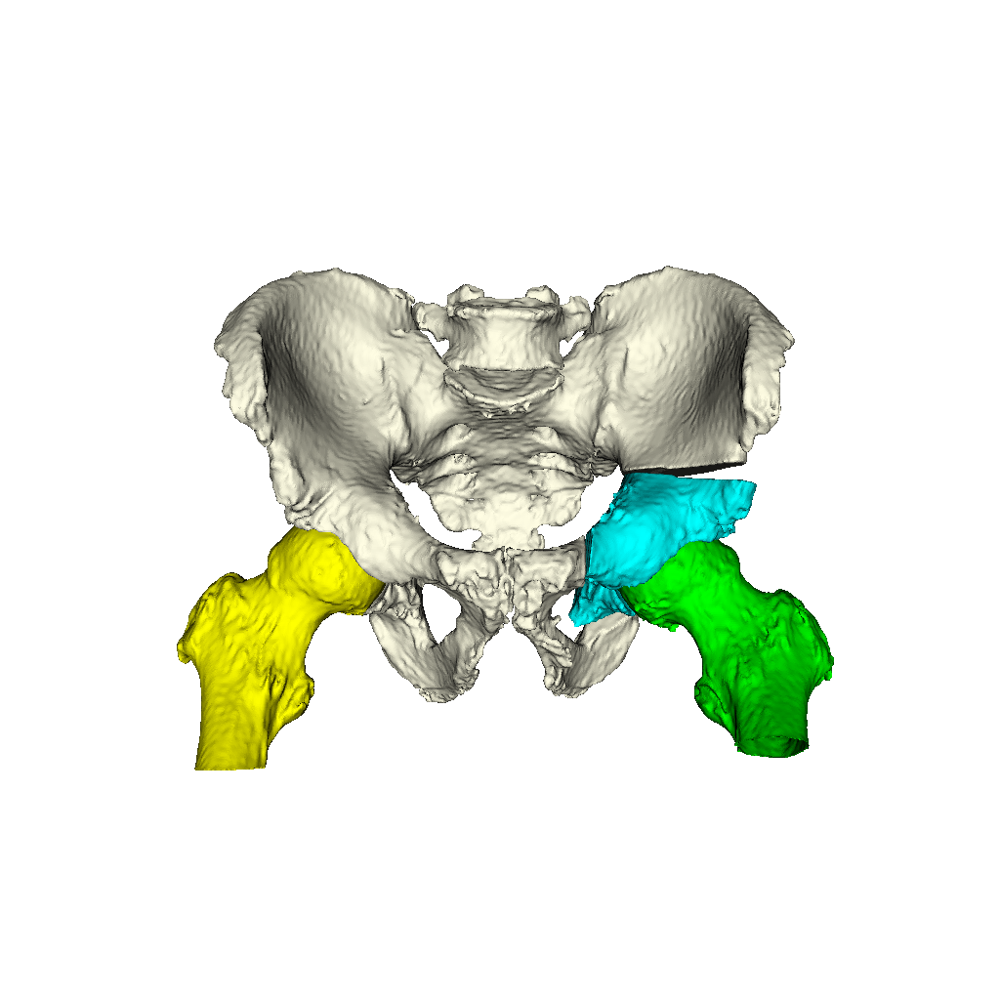
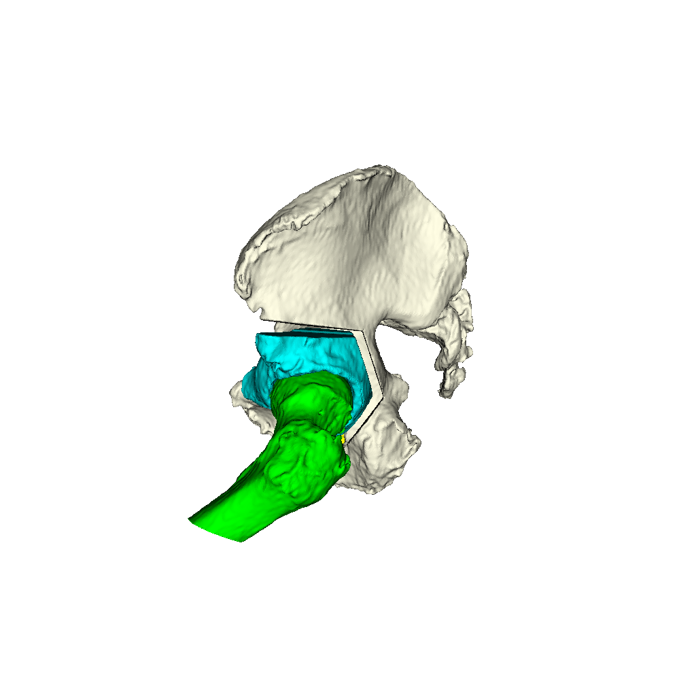

# 2D/3D Pelvis, Femur and PAO Fragment Registration Using Multiple Views
This tool performs a 2D/3D registration of multiple bones using information from multiple views.
The motivating example used here is to obtain and intraoperative estimate the relative poses of the femur and periacetabular (PAO) bone fragment with respect to the anterior pelvic plane (APP) of the pelvis.

Much like the [single-view pelvis example](../../pelvis_single_view_regi_2d_3d), the processing begins by first solving a single-view PnP problem for the pelvis and solving intensity-based registrations.
The pelvis pose is then registered using an intensity-based registration using all available views.
Note that the relative poses between each view are assumed to be known in this example.
The femur is then registered using multiple views, keeping the pelvis fixed at its current estimate.
Next, the fragment is registered while keeping the poses of the pelvis and femur fixed in the background.
This strategy continues at a finer resolution level: the pose of each object is refined while keeping the poses of the remaining two objects fixed.
Finally, the poses of all objects are refined simultaneous.
This is a similar strategy employed in (Grupp 2020) for registering a PAO fragment once the relative motion of the C-arm was recovered and the shape of the fragment was refined.
The videos produced by the example below also help to visualize the different registration stages.

The tool requires the following information as input:
  * 3D volume of the objects to be registered (stored in an ITK compatible file format, such as NIFTY/`.nii`/`.nii.gz`)
  * 3D segmentation labeling the pelvis, femur, and fragment to be registered - this is used to mask the objects in the input volume file and tightly crop about them (stored in an ITK compatible file format, such as NIFTY/`.nii`/`.nii.gz`)
  * The side which contains the fragment and femur to be registered; either "left" or "right"
  * 3D landmarks of the pelvis which are used to define the APP with an origin at the center of the ipsilateral femoral head (stored in FCSV format (`.fcsv`))
  * 3D landmarks of the pelvis which are used to solve the PnP problem (stored in FCSV format (`.fcsv`))
  * A collection of 2D views along with 2D landmarks in at least one view (stored in the JHMR projection data format which was used in [previous examples](../create_synthetic_fluoro))

The following information is optional input:
  * The projection index to be used for performing PnP initialization, this defaults to the first projection

Each registered pose of the pelvis, femur, and fragment are written to disk along with the two relative poses of the femur and fragment.

Optionally, a path to an output debug file may be provided.

A comprehensive listing of the program's usage may be obtained by passing `-h` or `--help`.

## Example: Multiple-View Pelvis, Femur, Fragment Registration
This example will leverage the existing data from the [single-view pelvis registration example](../../pelvis_single_view_regi_2d_3d), with the exception that all three views of the projection data will be used and a 3D segmentation of a PAO fragment plan will be used instead of the intact pelvis.

The projection data with annotated landmarks in the first view should be reused from the [single-view pelvis registration example](../../pelvis_single_view_regi_2d_3d) and the PAO fragment plan is reused from example 1 of the [PAO fragment creation tool](../create_fragment).

The registration is performed by executing the following command:
```
jhmr-pao-frag-mult-view-regi-2d-3d -v pelvis.nii.gz pao_cuts_seg.nii.gz left pelvis_app_lands.fcsv pelvis_regi_2d_3d_lands.fcsv example1_1_pd_003.h5 regi_pose_pelvis.h5 regi_pose_femur.h5 regi_pose_frag.h5 rel_pose_femur.h5 rel_pose_frag.h5 multi_obj_multi_view_debug.h5
```

The replay movies may be created using the [registration replay tool](../../../image_io/regi2d3d_replay) with the following command:
```
jhmr-regi2d3d-replay --video-fps 10 --proj-ds 0.5 multi_obj_multi_view_debug.h5
```

The movies should appear similar to the following animations:


The following commands will use the [PAO bone visualization tool](../draw_bones) to create AP and lateral visualizations of the pelvis, femur, and fragment using the relative poses recovered from the registration (an interactive display may be obtained by omitting the final positional argument to the PNG image file):
```
jhmr-pao-draw-bones pao_cuts_seg.nii.gz pelvis_app_lands.fcsv left --femur-frag-xform rel_pose_frag.h5 --femur-only-xform rel_pose_femur.h5 --femur-not-rel-to-frag multiple_view_regi_bones_viz_AP.png --cam-view ap --bg-color 1 1 1
```
```
jhmr-pao-draw-bones pao_cuts_seg.nii.gz pelvis_app_lands.fcsv left --femur-frag-xform rel_pose_frag.h5 --femur-only-xform rel_pose_femur.h5 --femur-not-rel-to-frag multiple_view_regi_bones_viz_LAT.png --cam-view lat --bg-color 1 1 1
```





As would be expected from a successful registration, this visualization looks very similar to the ground truth pose created in [example 1 of the fragment pose sampler](../sample_frag_moves).

## References
  * Grupp, Robert B., et al. "Pose estimation of periacetabular osteotomy fragments with intraoperative X-ray navigation." IEEE Transactions on Biomedical Engineering 67.2 (2020): 441-452.