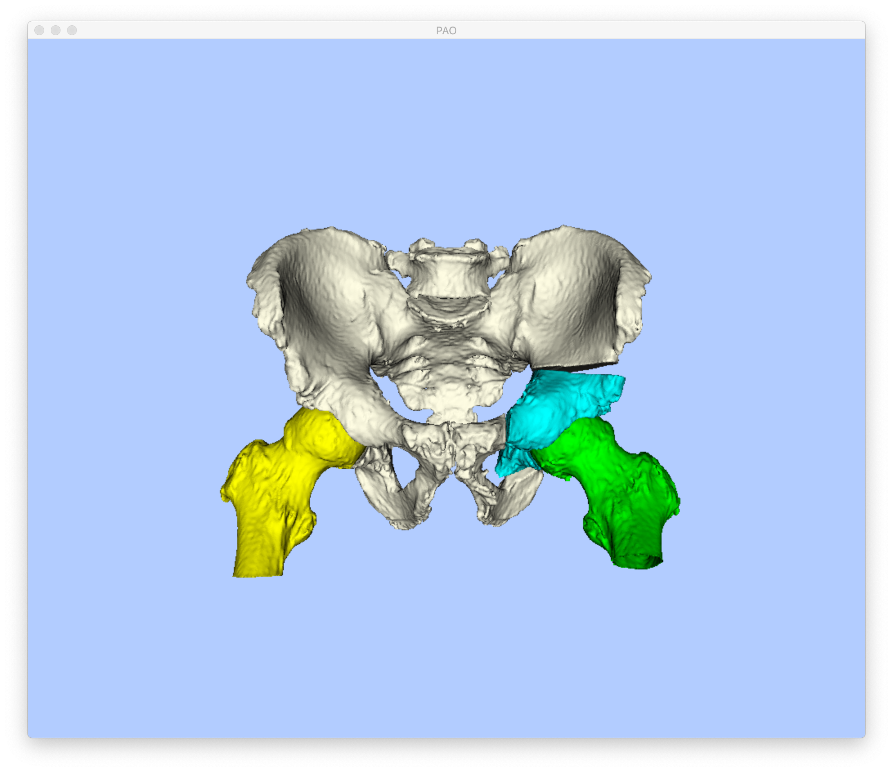
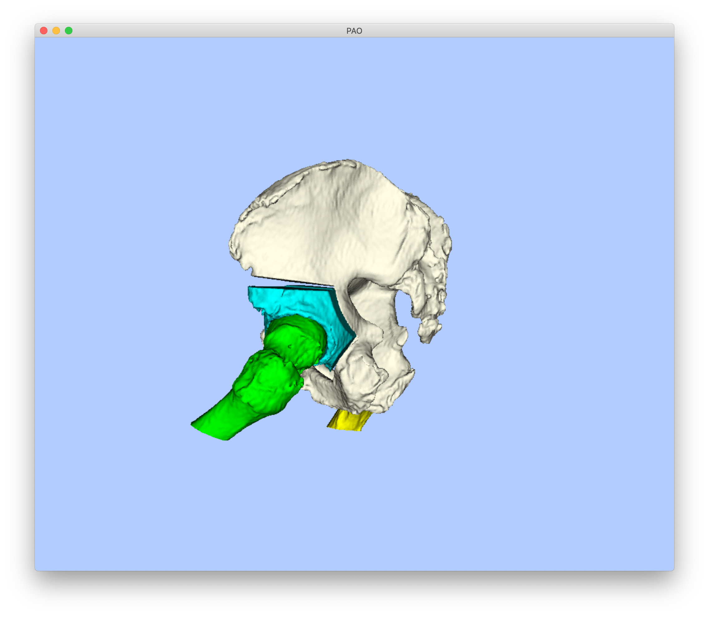

# Random Simulation of Periacetabular Osteotomy Fragment Adjustments
This tool samples random adjustments (rigid movements) of periacetabular osteotomy (PAO) bone fragments and the ipsilateral femur.
Plausible movements are enforced by sampling rigid transformations with anatomical priors and by checking for collision with bone structures.

A comprehensive listing of the program's usage may be obtained by passing `-h` or `--help`.

## Example
The fragment created in [Example 1 of the create fragment tool](../create_fragment) will be used as input for this example.
The following command will sample 10 random movements of the left PAO fragment and femur:
```
jhmr-pao-sample-frag-moves -v pao_cuts_seg.nii.gz pelvis_app_lands.fcsv left 10 test_pao --frag-rot-mean-x 10 --frag-rot-std-x 10 --frag-rot-mean-y 3 --frag-rot-std-y 3 --frag-rot-mean-z 12.5 --frag-rot-std-z 12.5 --trans-mean-x 2.5 --trans-std-x 5 --trans-mean-y -2 --trans-std-y 2 --trans-mean-z 2 --trans-std-z 3 --femur-rot-mean-x 10 --femur-rot-std-x 10 --femur-rot-mean-y 0 --femur-rot-std-y 5 --femur-rot-mean-z 0 --femur-rot-std-z 2 --morph-open-size 5 --uniform-sampling
```
One of the fragment adjustments may be visualized using the [draw bones tool](../draw_bones):
```
jhmr-pao-draw-bones pao_cuts_seg.nii.gz pelvis_app_lands.fcsv left --femur-frag-xform test_pao_frag_0.h5 --femur-only-xform test_pao_femur_0.h5
```
The following two screenshots demonstrate an example visualization:


