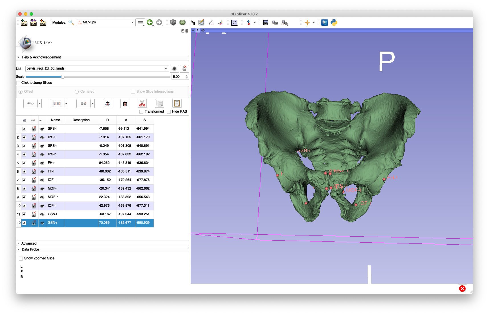
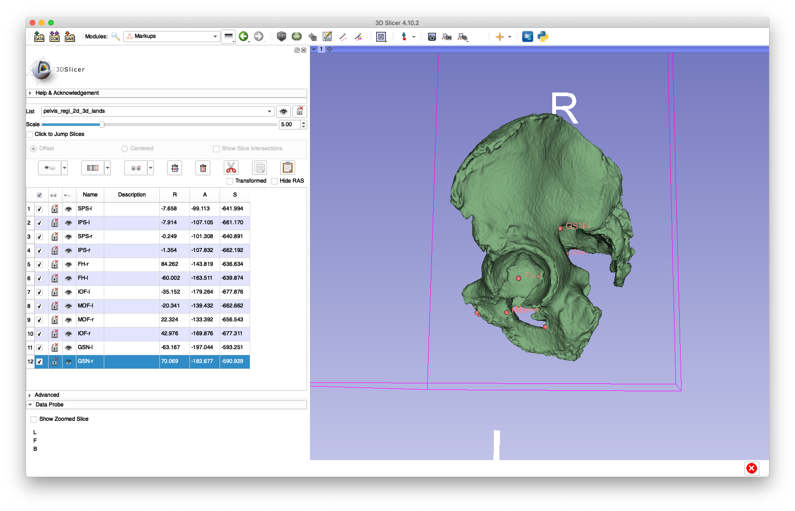
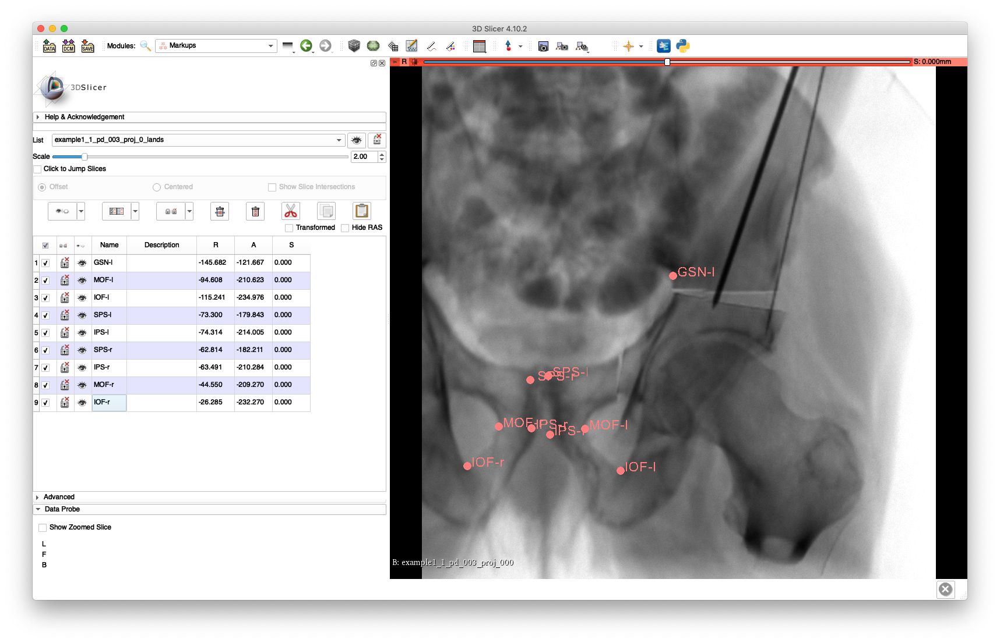
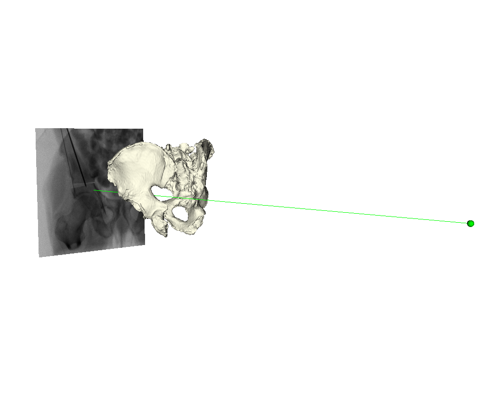
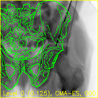
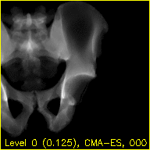

# 2D/3D Pelvis Registration Using a Single-View
This tool will perform a registration of a single 3D object (e.g. the pelvis), represented by a CT scan, to a single 2D fluoroscopy view.
The tool first computes a paired point registration using anatomical landmarks previously identified in the 3D volume and the 2D view.
A multiple-resolution intensity-based registration is then performed using the pose produced by the paired point method as an initial estimate.
The final pose estimate is written to disk.
Optionally, some debug information is also written which is useful for determining a successful registration or for debugging any problems with the processing.

The tool requires the following information as input:
  * 3D volume of the object to be registered (stored in an ITK compatible file format, such as NIFTY/`.nii`/`.nii.gz`)
  * 3D landmarks of the object to be registered (stored in FCSV format (`.fcsv`))
  * A 2D view along with 2D landmarks (stored in the JHMR projection data format which was used in [previous examples](../pao/create_synthetic_fluoro))

The following information is optional input:
  * 3D segmentation of the object to be registered - this is used to mask the object in the input volume file and tightly crop about it (stored in an ITK compatible file format, such as NIFTY/`.nii`/`.nii.gz`)
  * The projection index to be registered (if the projection data contains multiple projections), this defaults to the first projection

A comprehensive listing of the program's usage may be obtained by passing `-h` or `--help`.

## Example: Single-View Pelvis Registration
This example picks up from [example 1 of the synthetic fluorocopy tool](../pao/create_synthetic_fluoro) and will require the resampled CT intensity file of the pelvis before osteotomy (`pelvis.nii.gz`), the segmentation of the pelvis before osteotomy (`pelvis_seg.nii.gz`), and the first view of the fourth simulated orbit (`example1_1_pd_003.h5`).
The pelvis will be registered to the first view of the simulated projections.

As shown below, the 3D landmarks required for the paired point registration are annotated using 3D Slicer:




The following bilateral landmarks were annotated:
  * Femoral head center (`FH`)
  * Medial aspect of the obturator foramen (`MOF`)
  * Inferior aspect of the obturator foramen (`IOF`)
  * Greater sciatic notch (`GSN`)
  * Superior pubic symphisis (`SPS`)
  * Inferior pubic symphisis (`IPS`)

The left or right side is indicated by appending a `-l` or `-r`, e.g. `FH-l` for the left femoral head center and `IOF-r` for the right inferior aspect of the obturator foramen.
An example of these annotations is given in [this FCSV file](zz_readme/pelvis_regi_2d_3d_lands.fcsv).

The 2D landmarks may also be annotated using 3D Slicer.
In order to perform this annotation, the projection must be extracted from the projection data HDF5 file into a format recognized by 3D Slicer, such as NIFTY.
The [following command](../../image_io/extract_nii_from_proj_data) will extract the first projection from HDF5 projection file (`example1_1_pd_003.h5`) into an output NIFTY file (`example1_1_pd_003_proj_000.nii.gz`):
```
jhmr-proj-data-extract-nii -v example1_1_pd_003.h5 example1_1_pd_003_proj 0
```
The landmarks may be annotated by opening the NIFTY file in 3D Slicer as demonstrated below:

Note that `FH-l` was not annotated because it has been rigidly transformed separately from the main pelvis fragment, and the `FH-r` and `GSN-r` landmarks were not annotated as they are not visible in the view.
An example of these annotations is given in [this FCSV file](zz_readme/example1_1_pd_003_proj_0_lands.fcsv).
These landmarks may be added back into the projection HDF5 file using the [following command](../../image_io/add_lands_to_proj_data):
```
jhmr-add-lands-to-proj-data -v example1_1_pd_003.h5 example1_1_pd_003_proj_0_lands.fcsv
```
The addition of the landmarks may be verified using the [remap and tile tool](../../image_io/remap_and_tile_proj_data):
```
jhmr-remap-tile-proj-data example1_1_pd_003.h5 -o -p 0 -d 0.25 example1_1_pd_003_proj_0_w_lands.png
```
This should output an image similar to the following, with yellow circles indicating the locations of the annotated landmarks:


The following command will now run the registration:
```
jhmr-hip-surg-pelvis-single-view-regi-2d-3d pelvis.nii.gz pelvis_regi_2d_3d_lands.fcsv example1_1_pd_003.h5 regi_pose_example1_1_pd_003_proj0.h5 regi_debug_example1_1_pd_003_proj0_w_seg.h5 -s pelvis_seg.nii.gz
```
This command uses the `-s` flag to pass the 3D pelvis segmentation and mask out non-pelvis structures, such as the femurs, soft-tissues, vertebra and air, from the input volume.
The estimated pose of the pelvis is saved in `regi_pose_example1_1_pd_003_proj0.h5` and some debug information will be written in `regi_debug_example1_1_pd_003_proj0_w_seg.h5`.
Debug information is not written to disk when the path to the output debug information file is not provided.

Using the registration, [the scene visualization tool](../../image_io/draw_xray_scene) may be used to render the pelvis with respect to the projective coordinate frame:



The following command was used to start the visualization tool:
```
jhmr-draw-xray-scene example1_1_pd_003.h5 -p 0 pelvis.stl regi_pose_example1_1_pd_003_proj0.h5 -i --bg-color 1 1 1 --mesh-color-bone
```

The debug information may now be used to create a video visualization of the registration processing using the [registration replay tool](../../image_io/regi2d3d_replay):
```
jhmr-regi2d3d-replay regi_debug_example1_1_pd_003_proj0_w_seg.h5 --video-fps 10 --proj-ds 0.5
```

The `video-fps` flag indicates the desired framerate (10) for the output videos and the `proj-ds` flag indicates that the output videos should have 2D dimensions downsampled to be one half of the original dimensions of the projection data.

This command will output two movie files: `edges.mp4` and `mov.mp4` (these file names may also be specified as command line arguments).
The "edges" movie (`edges.mp4`) will keep the fluoroscopy being registered to fixed in the background while overlaying green contours corresponding to the current pose estimate of the pelvis.
These contours should align well with features of the fluoroscopy when the pelvis is properly registered.
Each frame of the `mov.mp4` video displays a simulated projection corresponding to the current pose estimate of the pelvis.
The text at the bottom of each video indicates the resolution level along with the downsampling factor used during processing in parentheses, the name of the current registration approach, and the iteration number of the current registration approach.

The `edges.mp4` and `mov.mp4` movies should look similar to these animations:




The overlaid contours are not aligned with the fluoroscopy at the beginning of the edges movie, indicating that the initial paired point registration is not well-registered.
At the conclusion of the movie the contours appear to align well with the large pelvis fragment in the fluoroscopy indicating that the registration has succeeded.
Although the contours are not in agreement in the acetabulum region, we would not expect these to agree as the fractured pelvis in the fluoroscopy differs from the unfractured 3D model of the pelvis used here.
The relative motion of the imager between several views may be recoverd using a single-view registration on each view and then using the patient's pelvis as a fiducial object.
A variation of this approach was used in (Grupp 2020).
The registration of multiple, less distinctive, objects and partial 3D reconstructions are possible once the multiple-view geometry is recovered.
An example of multiple-object, multiple-view, registration is given [here](../pao/frag_multi_view_regi_2d_3d).

The above animated GIFs were produced using the `debug-img-prefix` flag of the replay tool and the `convert` command included with [Image Magick](https://imagemagick.org).

## References
  * Grupp, Robert B., et al. "Pose estimation of periacetabular osteotomy fragments with intraoperative X-ray navigation." IEEE Transactions on Biomedical Engineering 67.2 (2020): 441-452.