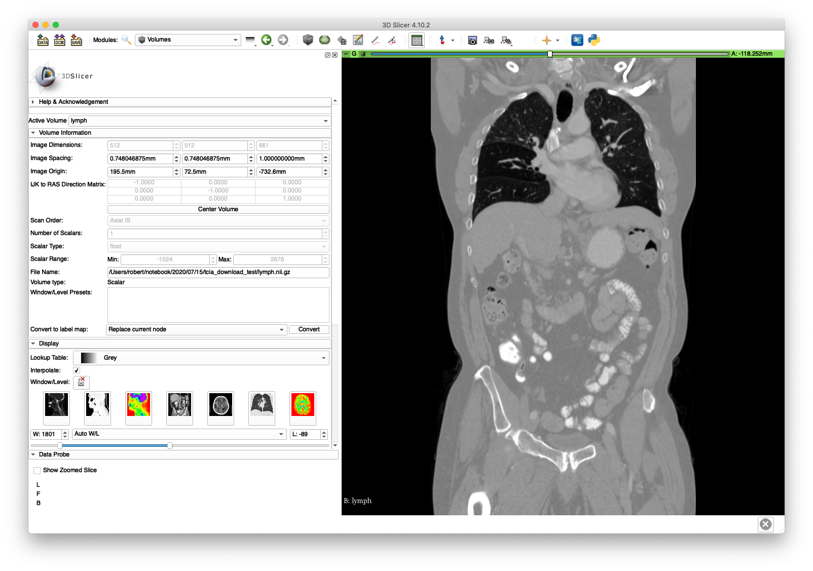
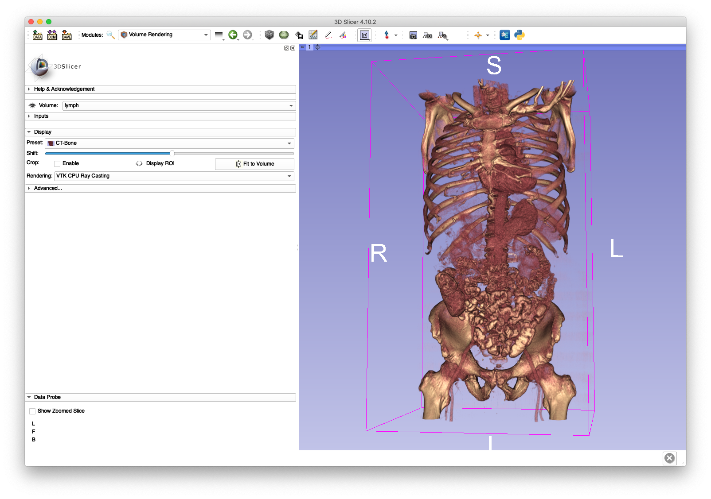
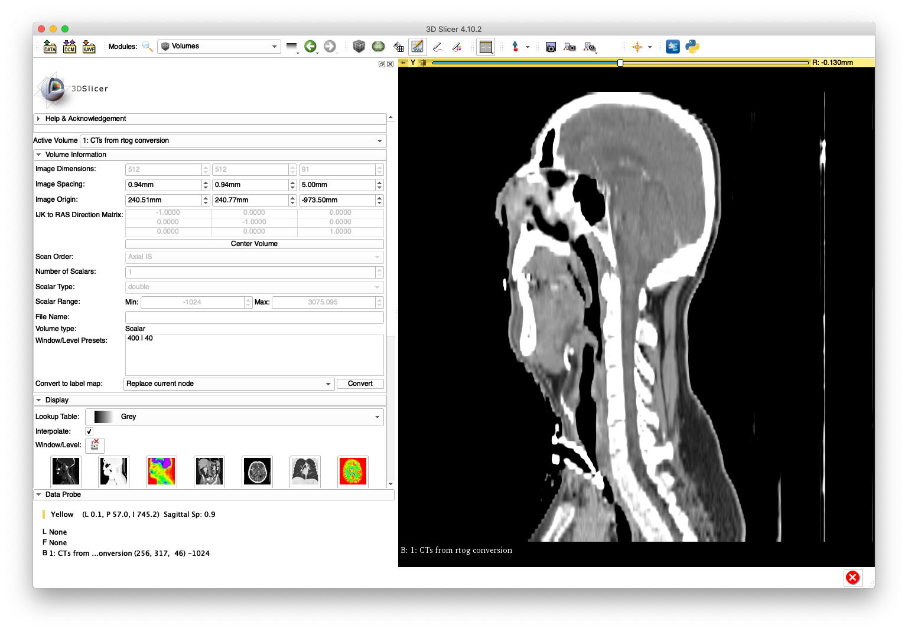
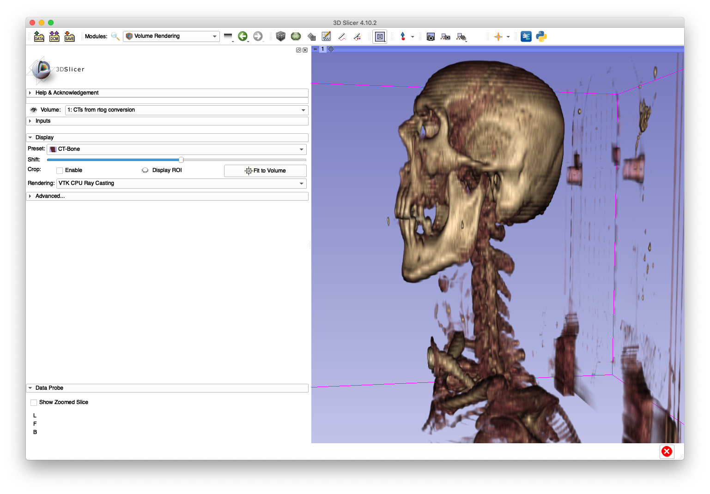
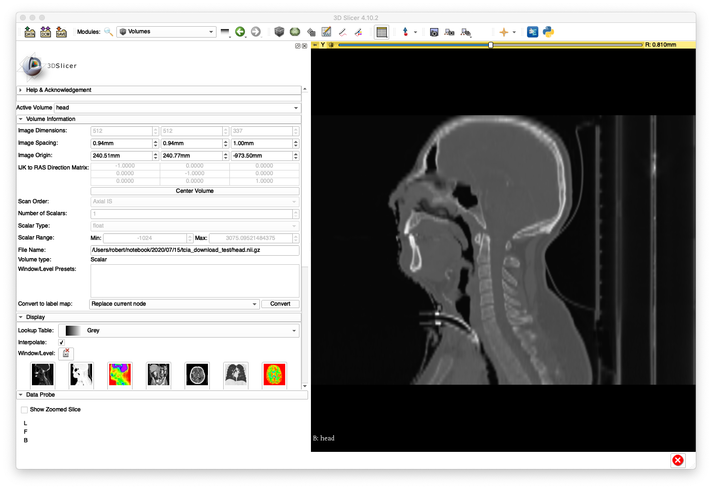
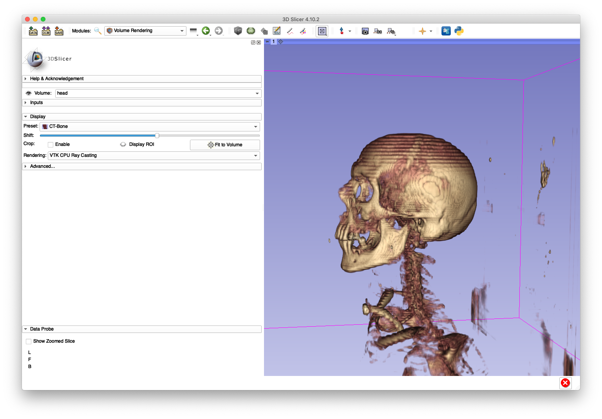
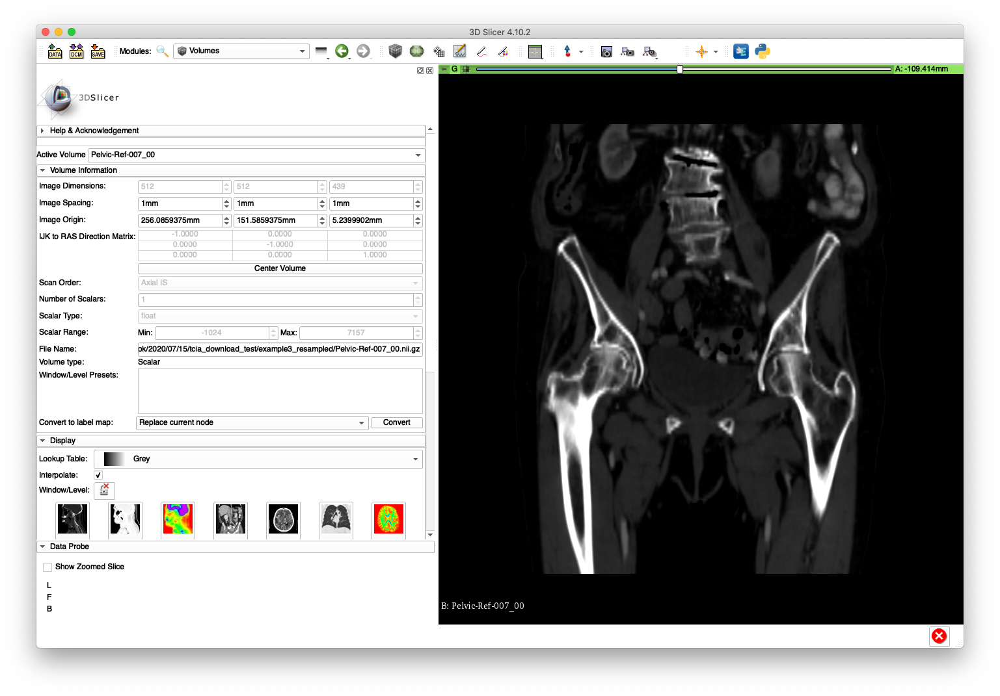
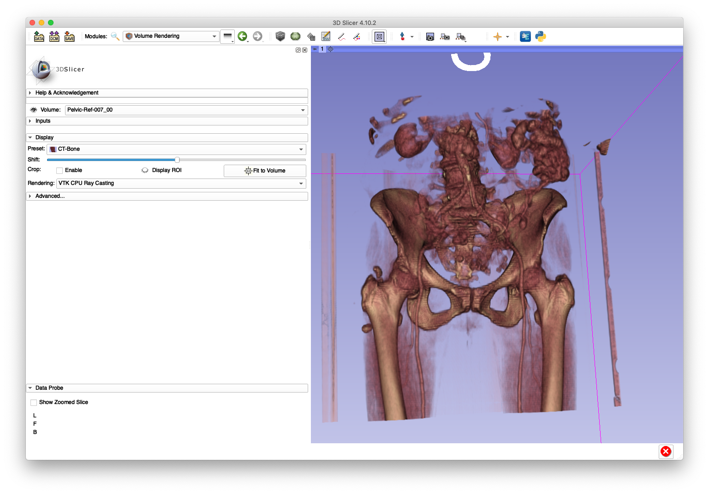

# DICOM Conversion and Resampling
This program provides some functionality for converting a collection of DICOM series into volume file formats, such as NIFTI (.nii, .nii.gz), MHD (.mhd,.mha), or NRRD (.nrrd).
Optionally, the data may also be resampled to user-specified pixel spacings.
Pass `-h` or `--help` to print out a detailed usage description.

## Example 1
First download a DICOM series from the "Lymph Nodes" dataset available on The Cancer Imaging Archive (TCIA).
The `curl` command (usually included with most MacOS installations) for this is:
```
curl "https://services.cancerimagingarchive.net/services/v4/TCIA/query/getImage?SeriesInstanceUID=61.7.167248355135476067044532759811631626828" > ABD_LYMPH_001.zip
```
The corresponding `wget` command, which is typically used on most Linux installations, is:
```
wget "https://services.cancerimagingarchive.net/services/v4/TCIA/query/getImage?SeriesInstanceUID=61.7.167248355135476067044532759811631626828" -O ABD_LYMPH_001.zip
```
After this zip file is downloaded, extract its contents in a new directory:
```
unzip ABD_LYMPH_001.zip -d ABD_LYMPH_001
```
Notice that this directory contains many DICOM files, where each file represents a 2D slice.
A 3D volume is formed by stacking all of these slices together.
The following command will perform this stacking and keep the original in-plane pixel spacings and out-of-plane slice spacings intact:
```
jhmr-convert-dicom ABD_LYMPH_001 lymph.nii.gz --one
```
The first positional argument is the directory containing the collection of DICOM files and the second positional argument is the name of the output volume file.
The `--one` flag indicates that the input directory should only contain a single DICOM series and only one output volume file will be created.
The default behavior of this tool is to recursively scan the input directory for all DICOM series and convert each series to a volume file named with a prefix according to the second argument.
This behavior is shown in [Example 3](#Example-3).

The `lymph.nii.gz` may be loaded in software such as 3D Slicer and visualized.
A coronal slice and volume rendering are shown below:



The `lymph.nii.gz` file is also used in examples for the following tools:
* [Volume cropping](../crop_vol)
* [Mesh creation](../../mesh/create_mesh) (uses the cropped volume)

## Example 2
This example will highlight an instance of non-uniform out-of-plane slice spacing.
We will once again retrieve a DICOM series from TCIA, but this time from the "Head-Neck Cetuximab" dataset:
```
wget "https://services.cancerimagingarchive.net/services/v4/TCIA/query/getImage?SeriesInstanceUID=1.3.6.1.4.1.22213.2.26559.2" -O 0522c0012.zip
```
```
unzip 0522c0012.zip -d 0522c0012
```

In order to illustrate an incorrect handling of non-uniform slice spacing, import the DICOM series directly into 3D Slicer (version 4.10.2) using the "DCM" module.
A sagittal slice view and volume rendering of the bone is shown below:


This anatomy appears "stretched" in the inferior/superior direction as a result of using a constant slice-spacing when the spacing is not actually constant.

Fortunately, the conversion tool here is able to handle this case with the following command:
```
jhmr-convert-dicom 0522c0012 head.nii.gz --one --ss 1
```
Note that the volume files formats used in medical imaging all assume constant spacings, so the `--ss` is passed to resample the out-of-plane dimension to have slice spacings of 1 mm.
After loading `head.nii.gz` into 3D Slicer, the sagittal slice view and volume rendering now show anatomy with a reasonable appearance:
A sagittal slice view and volume rendering of the bone is shown below:


The artifacts on the superior aspect of the skull are caused by large slice spacings in that region.
The Slicer DICOM code may have used the larger spacing between the first two slices as a constant slice spacing in the entire series, which would explain why the anatomy becomes elongated when Slicer directly imports the DICOM.

## Example 3
This example demonstrates the ability of the tool to recursively scan a directory for multiple DICOM series and convert each to a volume file.

First, create a new directory and move the DICOM files from the previous two examples directly into this directory:
```
mkdir example3
```
```
mv ABD_LYMPH_001/* example3
```
```
mv 0522c0012/* example3
```
Next, download a new series and extract it into its own sub-directory of `example3`:
```
wget "https://services.cancerimagingarchive.net/services/v4/TCIA/query/getImage?SeriesInstanceUID=1.3.6.1.4.1.14519.5.2.1.7085.2036.250414168115194829513813393188" -O Pelvic-Ref-007.zip
```
```
unzip Pelvic-Ref-007.zip -d example3/Pelvic-Ref-007
```
At this point the `example3` directory directly holds a collection of DICOM files from two series and a sub-directory with DICOM files from another series.
Now, create a destination directory for the output volume files:
```
mkdir example3_resampled
```
The following command will convert each DICOM series into a separate volume file:
```
jhmr-convert-dicom example3 example3_resampled --iso 1
```
By default, each output volume file is named according to the patient ID DICOM field.
The `example3_resampled` directory should be populated with the following three volumes:
* `0522c0012_00.nii.gz`
* `ABD_LYMPH_001_00.nii.gz`
* `Pelvic-Ref-007_00.nii.gz`

The specification of `--iso 1` indicates that each input DICOM series will be output to have 1 mm isotropic pixel spacings.
The below slice and volume rendering views are obtained after loading `Pelvic-Ref-007_00.nii.gz` into 3D Slicer:


