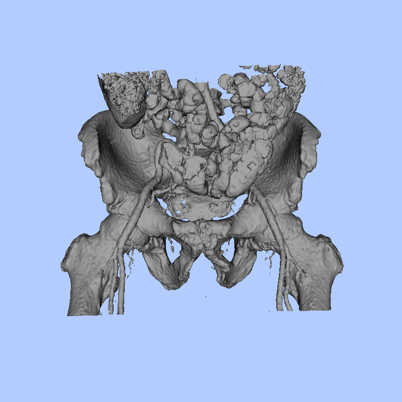
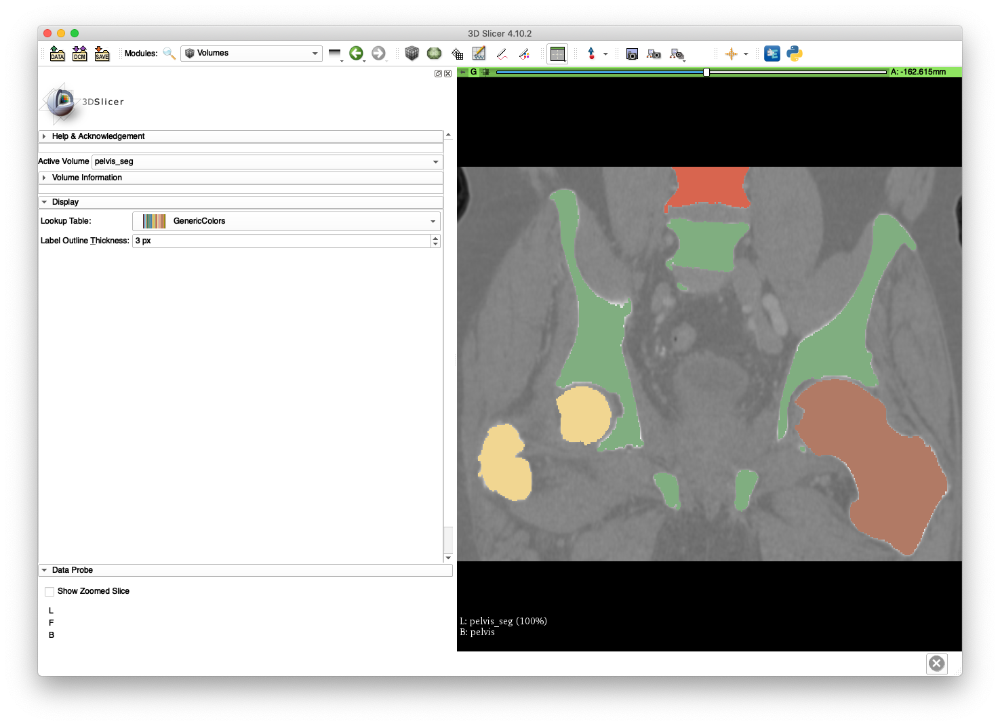
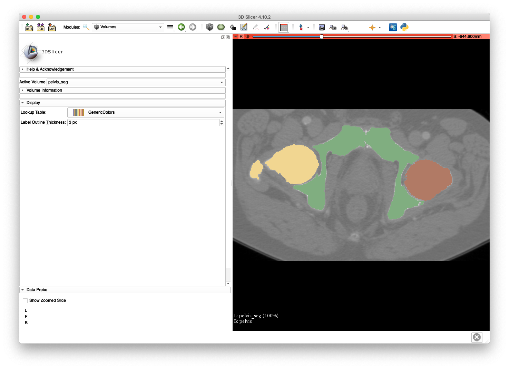
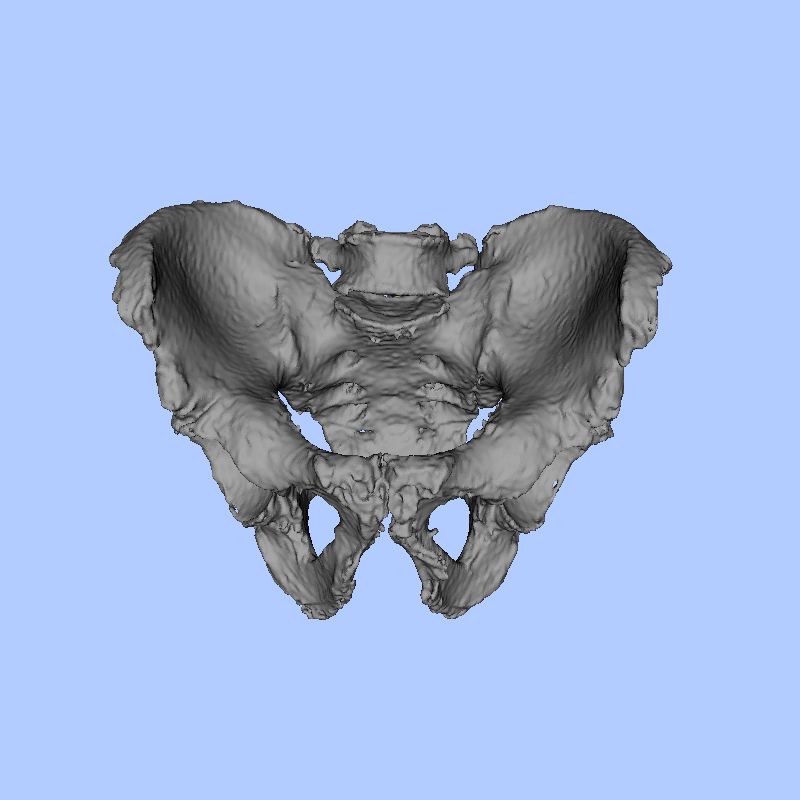

# Surface Mesh Creation
This tool creates a surface mesh from an input volume.
The volume may either be a label map or an image of intensities.

# Example 1
This example uses the `pelvis.nii.gz` volume created as part of the [volume cropping example](../../image_io/crop_vol).
The following command will create a surface mesh of the anatomy by implicitly creating a label map corresponding to voxels with intensities greater than 150 HU:
```
jhmr-create-mesh -i --lower 150 pelvis.nii.gz pelvis_thresh_sur.ply
```
The output mesh can be visualized using the [show mesh tool](../show_mesh), with the following command:
```
jhmr-show-mesh pelvis_thresh_sur.ply
```
A similar visualization to that below should be obtained after manually adjusting the view:


Note that the bowel and the femoral artery are visible due to contrast agent.

# Example 2
This example will use a label map computed as part of a segmentation of the same `pelvis.nii.gz` volume used in example 1.
We shall leverage an external tool for segmenting the anatomical structures in this volume.
In particular, we will use the software created by Marcel Krčah for his ISBI 2011 paper, which is available [here](https://github.com/mkrcah/bone-segmentation).
Run the following command once the segmentation software is compiled:
```
SegmentBoneFromCT pelvis.nii.gz tmp pelvis_seg.nii.gz
```
`tmp` is just a temporary directory and `pelvis_seg.nii.gz` is the output segmentation.
Loading the intensity and label volumes into 3D Slicer results in views such as the following:



The pelvis, sacrum, and L5 are assigned label 1, the right femur is assigned label 2, and the left femur is assigned label 3.

A surface mesh corresponding to the pelvis segmentation may be created with the following command:
```
jhmr-create-mesh pelvis_seg.nii.gz pelvis_sur.ply 1
```
The following command will display the surface, which is also shown below:
```
jhmr-show-mesh pelvis_sur.ply
```

