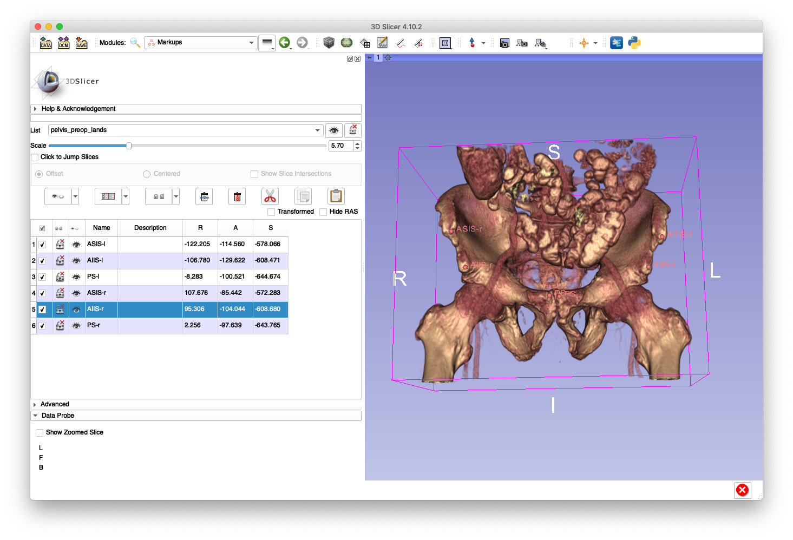
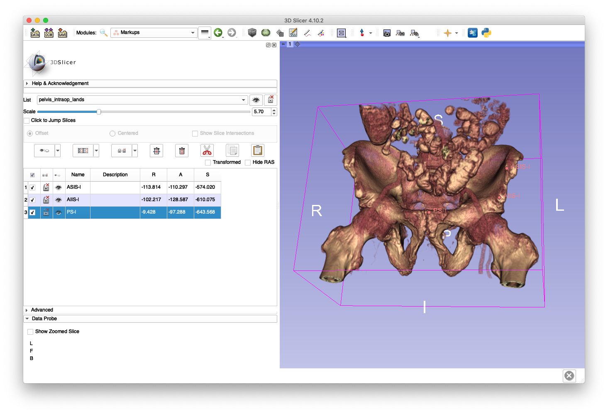
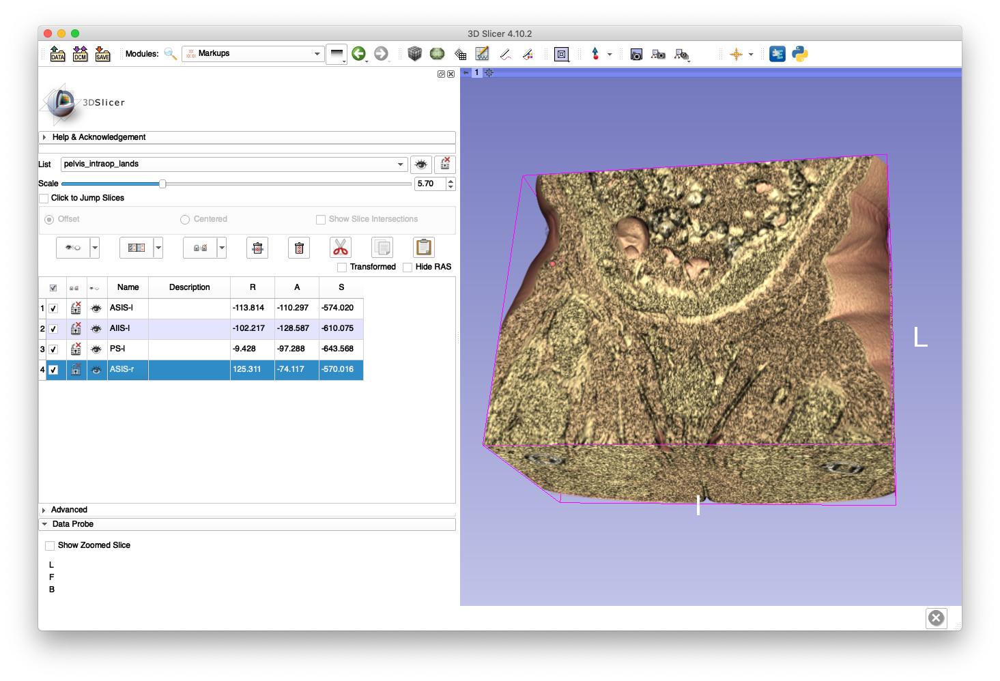
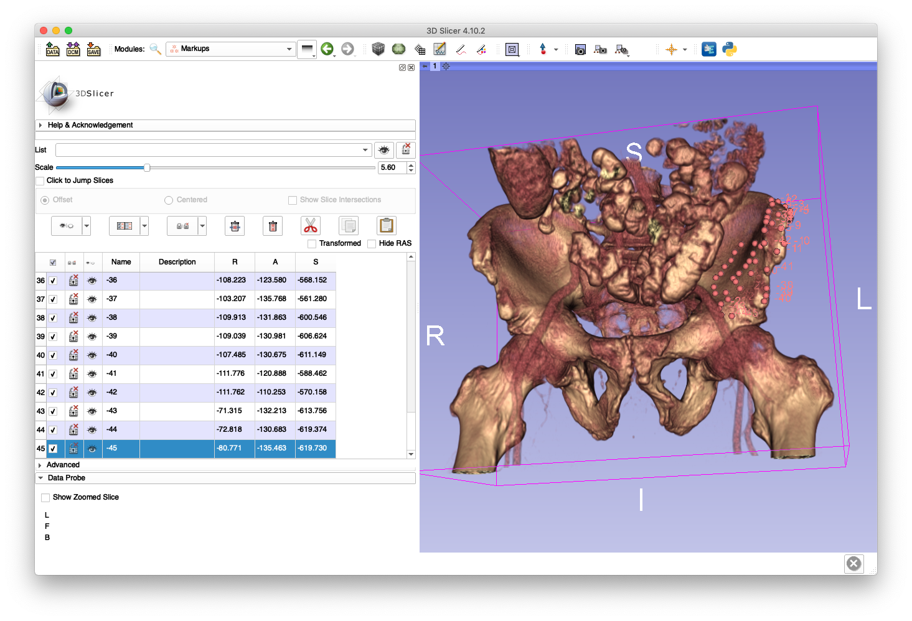
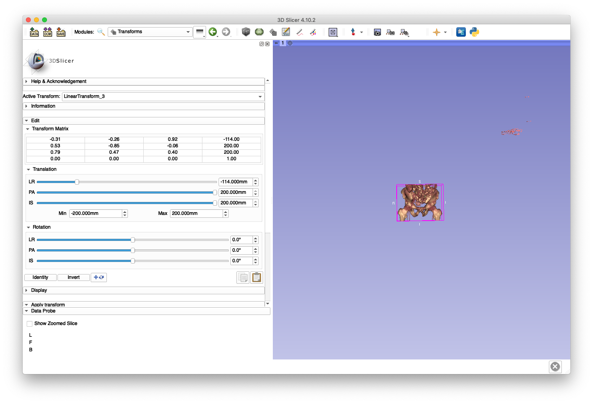
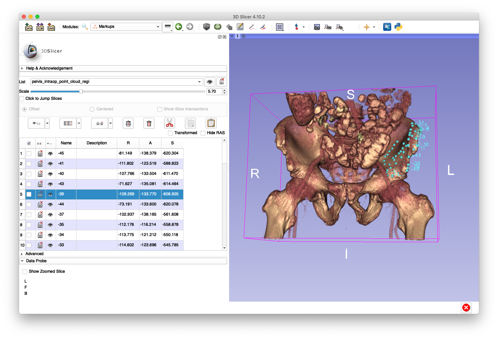

# Point Cloud to Surface Registration
This tool performs a registration between a point cloud and a surface using the iterative most-likely point (ICP) approach.
The method optimizes over a rigid tranformation, but may also attempt to recover scale.
ICP is intialized using the identity transformation by default, but two FCSV files may be provided in order to perform a paired-point registration to provide a better initialization.
A KD-Tree of the surface is constructed in order to efficiently perform closest-point lookups.

## Example
This example will simulate the case of an intraoperative registration of the pelvis by digitizing points on the pelvis surface with a tracked tool.
The `pelvis.nii.gz` volume created in the [crop volume example](../../image_io/crop_vol) and the `pelvis_sur.ply` mesh created in the [create mesh example](../create_mesh) will be reused in this example.

First, load the pelvis volume into 3D Slicer and launch a volume rendering with a threshold displaying the bone surface.
Next, use the fiducials module (point picker) to identify the following bilateral landmarks:
* Anterior Superior Iliac Spine (ASIS)
* Anterior Inferior Iliac Spine (AIIS)
* Pubic Symphisis (PS)
A suffix of "-l" is used to indicate left side and "-r" is used to indicate the right side.
The following screenshot demonstrates this process:

Save this FCSV file as `pelvis_preop_lands.fcsv` (an example is [here](zz_readme/pelvis_preop_lands.fcsv)).
These will simulate preoperatively identified landmarks that will be useful for initializing an intraoperative ICP registration.

Next, we shall simulate the process of digitizing these landmarks intraoperatively for a surgery on the left side.
In a new markup fiducials list, choose the ASIS-l, AIIS-l and PS-l again, but choose the landmarks slightly imprecisely and not exactly where the preoperative landmarks were selected.
This is shown in the following screenshot:

Since the surgery is on the left side, we have assumed that an incision was made, soft-tissues dissected, and a tracked pointer tool is able to sufficiently reach the boney anatomy.
Next, we shall simulate a digitization of the ASIS-r on the skin surface.
Lower the volume rendering threshold and choose a point roughly corresponding to the ASIS-r.

Since the volume was previously cropped, much of the skin surface is not visible.
However, this will suffice for illustrating this example.

We shall now create a simulation of the clinicial moving the tracked pointer across the pelvis surface.
Change the volume rendering back to show the bone surface, create a new markup fiducials list, and start digitizing points along the left iliac crest, left iliac spine, and left ilium wing.
An example of this is shown below:


Next, use the transforms module in Slicer to apply an arbitrary rigid transform to the intraoperative landmarks and point cloud as shown below:

Use the "harden" transform button on the fiducials and save the intraoperative landmarks to disk as `pelvis_intraop_lands.fcsv` (an example is [here](zz_readme/pelvis_intraop_lands.fcsv)) and `pelvis_intraop_point_cloud.fcsv` (an example is [here](zz_readme/pelvis_intraop_point_cloud.fcsv)).

We are now ready to run the ICP registration:
```
jhmr-sur-regi pelvis_sur.ply pelvis_intraop_point_cloud.fcsv pelvis_regi.h5 --mesh-lands pelvis_preop_lands.fcsv --pts-lands pelvis_intraop_lands.fcsv
```
The output registration transform will be saved as `pelvis_regi.h5`.
Passing the verbose flag (`-v`) will enable printing of some other diagnostic information of the method, of which an example snippet is listed below:
```
reading mesh from disk...
  complete.
Point Cloud is FCSV: Yes
reading point cloud from disk...
  complete.
converting FCSV point cloud RAS --> LPS...
reading mesh landmarks...
    AIIS-r:   +95.306000 ,  -104.043999 ,  -608.679993
    ASIS-r:  +107.676003 ,   -85.442001 ,  -572.283020
    AIIS-l:  -106.779999 ,  -129.621994 ,  -608.471008
      PS-r:    +2.256000 ,   -97.639000 ,  -643.765015
      PS-l:    -8.283000 ,  -100.521004 ,  -644.674011
    ASIS-l:  -122.205002 ,  -114.559998 ,  -578.065979
reading point cloud landmarks...
    ASIS-r:  -655.932007 ,  +360.757996 ,   +36.963001
    AIIS-l:  -608.034973 ,  +288.065002 ,  -183.858994
      PS-l:  -675.512024 ,  +312.785004 ,  -109.380997
    ASIS-l:  -576.088013 ,  +264.449005 ,  -170.052994
landmarks RAS --> LPS...
estimating initial transformation using corresponding paired points...
running ICP...
ICP init...
  Creating KD-Tree for target surface...
    KD-Tree created.
Allocating additional working buffers...
ICP init complete!
Starting Point to Surface ICP: Num Pts 45
   Surface Num Verts 302318, Num Tri Faces 604788
  Initial Xform:
-0.329926  0.509905 -0.794447   311.505
-0.260543 -0.858066 -0.442538   -38.787
 -0.90734 0.0609827   0.41595   32.7704
        0         0         0         1
    Stop Thresh: 0.999
  Compute Scale: No
   Outlier Det.: No
  Iteration 0
    Xform:
-0.329926  0.509905 -0.794447   311.505
-0.260543 -0.858066 -0.442538   -38.787
 -0.90734 0.0609827   0.41595   32.7704
        0         0         0         1
    Mean Dist: 3.99371
  Iteration 1
    Xform:
-0.338177  0.538369 -0.771878   326.728
-0.266438 -0.841416 -0.470138  -35.3461
-0.902578 0.0466676  0.427989   28.3553
        0         0         0         1
    Mean Dist: 3.26624
    Delta Mean Dist. Ratio: 0.817846
  Iteration 2
    Xform:
-0.343989  0.558381 -0.754906   337.537
-0.269822 -0.828842 -0.490119  -33.1895
-0.899371 0.0350941  0.435776   24.7853
        0         0         0         1
    Mean Dist: 2.67226
    Delta Mean Dist. Ratio: 0.818147

.
.
.

  Iteration 52
    Xform:
-0.300638  0.530685 -0.792458   292.454
-0.246907 -0.845877 -0.472789  -49.0581
-0.921224 0.0535248  0.385333   35.9088
        0         0         0         1
    Mean Dist: 0.282814
    Delta Mean Dist. Ratio: 0.998813
  Iteration 53
    Xform:
-0.300588   0.53067 -0.792488   292.414
-0.246999 -0.845879 -0.472736  -48.9918
-0.921216 0.0536451  0.385336    35.949
        0         0         0         1
    Mean Dist: 0.282509
    Delta Mean Dist. Ratio: 0.998925
  Iteration 54
    Xform:
-0.300548  0.530636 -0.792526   292.373
-0.247109 -0.845892 -0.472656  -48.9141
-0.921199 0.0537845  0.385356   35.9935
        0         0         0         1
    Mean Dist: 0.282327
    Delta Mean Dist. Ratio: 0.999354
    termination criteria met: mean distance has stopped decreasing
writing regi transform to disk...
exiting...
```

Now transform the intraoperative point cloud using the registration transformation:
```
jhmr-xform-fcsv pelvis_intraop_point_cloud.fcsv pelvis_regi.h5 pelvis_intraop_point_cloud_regi.fcsv
```
This transformed point cloud may then be loaded into 3D Slicer and overlaid on the bone surface, shown below:

